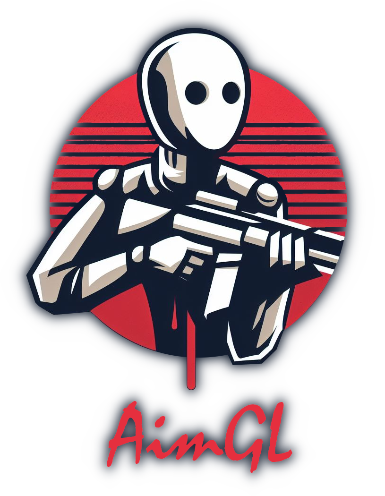

<h1>AimGL</h1>

This project is quite simple. You push yourself up the ranks of the top players, and I learn the OpenGL API and how to create games without using a pre-built engine. This is a minimalist game/tool for training shooting skills.

## About me and the project
I spent most of my life playing shooters of all kinds. Believe me or not, but what mattered most to me was shooting skills. I am a fan of one-tap (one shot - one frag). Anyone can win a 1 vs 5 clutch, but not everyone can do it by one-tapping the opponent. This cannot be learned without training. That's why this tool was created. 

### Project
The game will give several possible training scenarios. However, I will describe it better when I finish the game :3