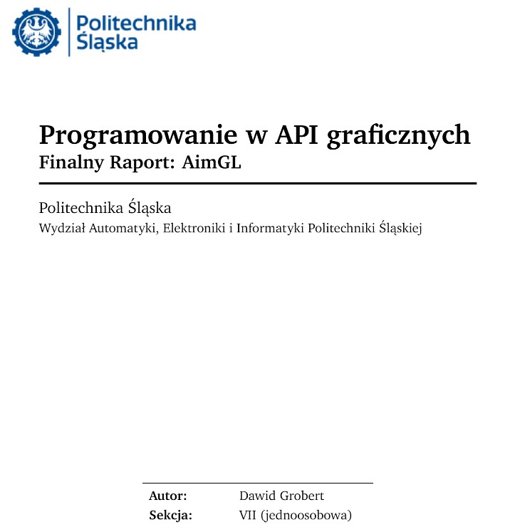

<h1>AimGL</h1>

 

A <a href="https://www.youtube.com/watch?v=hniT6IyqX_Q">video</a> showing how the game works

This project is quite simple. You push yourself up the ranks of the top players, and I learn the OpenGL API and how to create games without using a pre-built engine. This is a minimalist game/tool for training shooting skills.

### Project
It is developed without using the SFML graphics module (pure OpenGL). SFML is only used to create a window, take inputs or play sounds. Well... and still temporarily SFML graphics module is linked to display ImGui for debugging. This will be changed later. There are still many things missing to make it a fully-fledged aim trainer. It would need to add a good sensitivity converter from different games. Work on mouse input and so on.

### Features
* Logo state
* Training mode with static targets
* Training mode with moving targets
* Beautiful rifle (with lerped movement)
* Interactive buttons
* Basic physics.
* Skybox
* Wireframe
* In-Game Sounds
* Collisions & Colliders
* Pause
* ImGui debug menu

### Used Libraries
- **SFML** - creating a window, playing sound, picking up keyboard and mouse events. Without using part of the graphics module responsible for drawing 2D objects.
- **glm** - a mathematical library for graphics software, based on the GLSL specification.
- **stb** - a library designed for easy loading of images.
- **spdlog** - a logging library, useful for outputs like console logging.
- **result** - a lightweight, Rust-style error handling alternative to traditional exceptions.
- **glew** - provides powerful run-time mechanisms for determining which OpenGL extensions are supported on the target platform.
- **minitrace** - used to measure the execution time of code fragments.
- **imgui** - used only for debugging purposes as a development help.
- **ImGui-SFML** - an intermediate library linking SFML with ImGui.

### Technologies and tools
* **CMake** --- A multi-platform tool that allows to automatically manage of the compilation process.
* **C++20** --- C++ standard to be released in December 2020.
* **MSVC Compiler** --- A compiler developed by Microsoft.
* **CLion** --- JetBrains' multi-platform integrated development environment for C/C++ languages.
* **Clang-Format** --- C++ code formatter to ensure a stylistically consistent code style and format.
* **Git** --- A distributed version control system for tracking code changes.
* **Github** --- A web hosting service that allows hosting development projects using the Git version control system.

<h2>The report</h2>

You may find the report <a href="readme/final_report.pdf">here</a>. <b>but unfortunately it is in Polish!</b> An English-language version may be prepared one day.

